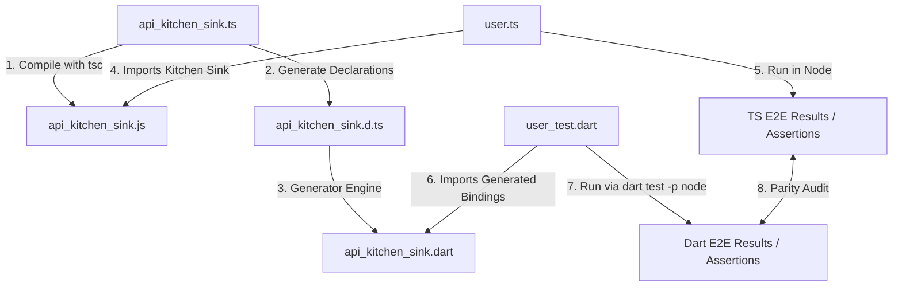

# End-to-End (E2E) Validation Plan: Testing Generated JS Interop Bindings

## 1. Context & Motivation

We have successfully evolved the `js_interop_gen` compiler engine to parse massive, full-scale TypeScript declaration files (like the VS Code API: `vscode_input.d.ts`) and produce clean, warning-free, statically analyze-green Dart interop libraries (`vscode_expected.dart`).

However, **static compliance does not guarantee dynamic correctness**. 

While the generated Dart code compiles without warnings under `dart analyze`, we currently have **zero automated runtime verification** proving:
1. That the generated getters/setters map to the actual JS properties.
2. That callbacks/events are invoked correctly across the Dart-to-JS boundary.
3. That overloaded methods and union type helper methods (e.g. `.asString`, `.asTaskScope`) operate as expected on real JS objects at runtime.
4. That promises (represented as `JSPromise`) correctly round-trip and resolve across boundaries.

To verify that what we generate *actually works*, we propose a **real-world end-to-end (E2E) integration test suite** using a synthetic but comprehensive mock API ("Kitchen Sink").

---

## 2. The E2E Verification Architecture

### Core Components

1. **`api_kitchen_sink.ts`**: A real TypeScript file implementing a mock API with complex patterns mirroring those found in `vscode_input.d.ts`.
2. **`user.ts`**: A native TypeScript consumer script that exercises every feature of the mock API and verifies runtime correctness using a testing framework or simple assertions.
3. **`api_kitchen_sink.d.ts`**: The TypeScript definition generated by `tsc` from `api_kitchen_sink.ts`. This serves as the generator's input.
4. **`api_kitchen_sink.dart`**: The Dart interop library generated from `api_kitchen_sink.d.ts` by `js_interop_gen`.
5. **`user_test.dart`**: A Dart counterpart to `user.ts` that exercises `api_kitchen_sink.dart` using exactly parallel calls and assertions.
6. **Verification Runner**: A test orchestration script/workflow that compiles and runs both TS/JS and Dart paths to ensure 100% behavioral parity.

---

## 3. The "Kitchen Sink" Coverage Matrix

To ensure we cover the "ins and outs" of VS Code and other common JS interop patterns, `api_kitchen_sink.ts` must implement:

| TS Feature | Target VS Code Pattern | Runtime Verification Goal |
| :--- | :--- | :--- |
| **Namespaces & Modules** | `declare module 'vscode'` | Test nested object paths and global scope attachment (e.g., `vscode.commands.registerCommand`). |
| **Union Types** | `string \| number`, `Uri \| string` | Test generated extension getters (`asString`, `asUri`) and verify correct casting & non-nullable check safety. |
| **Async & Promises** | `Thenable<T>`, `Promise<T>` | Verify that `JSPromise` objects can be converted/awaited in Dart and resolve to expected values. |
| **Callbacks & Events** | `Event<T>`, `(e: T) => any` | Test callback passing, event dispatching, and memory cleanup (disposal). |
| **Class Overloads** | Overloaded methods & constructors | Verify that different arities and type combinations resolve correctly on the JS side. |
| **Enums** | Numeric & String Enums | Test conversion between Dart interop enum wrappers and underlying JS values. |
| **Generics & Bounds** | `JSArray<T>`, custom bounds | Ensure generic collections and classes correctly pass typed elements without bounds exceptions. |
| **Optional Parameters** | `arg?: Type` | Verify that omitted arguments are passed as `undefined` and handled gracefully by JS. |

---

## 4. Finalized Design Choices (Decided & Approved)

We have resolved key architectural questions to establish a robust, standard E2E execution pipeline:

### 1. Execution Target & Compilation Pipeline for Dart E2E
* **Decision**: Use the standard `dart test` runner with Node.js platform support (`dart test -p node`).
* **Rationale**: This fits natively into the Dart package ecosystem, utilizing standard `package:test` assertions and runner mechanics. It automatically compiles the Dart test under the hood and runs it under Node.js where the real JS context is available.

### 2. Mock API Placement & Organization
* **Decision**: A dedicated integration folder: `test/integration/e2e/` containing:
  - `api_kitchen_sink.ts` / `user.ts` (TypeScript mock & reference test)
  - `user_test.dart` (Dart test mirroring `user.ts`)
  - `e2e_config.yaml` (Config for `js_interop_gen` generator to target the E2E kitchen sink)
* **Rationale**: Isolating E2E assets in their own folder prevents pollution of the existing parser unit tests under `test/integration/interop_gen/`.

### 3. Scope of TS Coverage Progression
* **Decision**: **Iterative Rollout**.
  - **Phase 1**: Build a minimal "Proof of Concept" (PoC) E2E test with a basic class, single union, primitive method, and callback. Get the compilation/execution pipeline and Node environment bootstrap 100% green first.
  - **Phase 2**: Expand `api_kitchen_sink.ts` and `user_test.dart` to include the remaining complex patterns (Promises, Events/Disposables, Overloads, and Generics with bounds).

### 4. Pre-loading the Mock JS Library in the Node Environment
* **Decision**: Inject and load `api_kitchen_sink.js` dynamically in the Dart test setup phase using an elegant JS interop invocation/eval.
* **Rationale**: Under Node.js, we can easily trigger a dynamic require or eval (e.g. `globalThis.kitchen = require('./api_kitchen_sink.js')`) to attach the mock library to the global namespace, allowing Dart's `@JS()` interop to bind seamlessly at runtime.

---

## 5. Implementation Blueprint

### Phase 1: Proof of Concept (PoC)

1. Create `test/integration/e2e/` directory.
2. Write a basic `api_kitchen_sink.ts` implementing a simple class and a primitive method.
3. Write `user.ts` validating it locally in Node.
4. Run `npx tsc` on `api_kitchen_sink.ts` to produce `.js` and `.d.ts`.
5. Run `js_interop_gen` on `api_kitchen_sink.d.ts` with `e2e_config.yaml` to produce `api_kitchen_sink.dart`.
6. Write `user_test.dart` importing `api_kitchen_sink.dart`, loading the JS bundle dynamically, and asserting parity.
7. Run `dart test -p node test/integration/e2e/user_test.dart`.

### Phase 2: Kitchen Sink Expansion

Once Phase 1's infrastructure and runner are confirmed green, incrementally implement and verify the comprehensive suite:
- Union types (`string | number`)
- Overloads (constructors, methods)
- Promises and async operations (`JSPromise`, `Thenable`)
- Callbacks and Events (disposable handlers)
- Generics and custom bounds
- String/numeric enums
