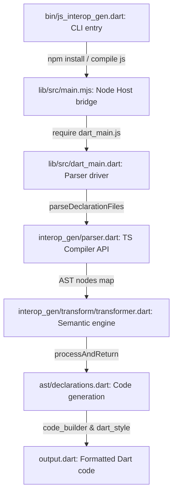

# 📊 Principal Engineer Clean-Pass Audit & High-Autonomy Execution Backlog

This document provides a rigorous, clean-pass architectural and quality audit of the `js_interop_gen` generator tools in the [dart-lang/web](file:///Users/kevmoo/github/web) monorepo. It establishes high-fidelity design metrics, maps explicit/implicit boundaries, exposes structural anomalies, traces critical code execution, and lists a fully-actionable, prioritized backlog.

---

## 🗺️ PHASE 0 — ORIENTATION

* **Stack**: 
  - **Languages**: Dart (compiles via `dart compile js` to a wrapper JS bundle), JavaScript/TypeScript (Node v22 runtime targeting the TypeScript compiler API and `webidl2`).
  - **Framework/Libraries**: Standard Dart compiler CLI tool. Core code-generation utilizes `package:code_builder` for AST emission and `package:dart_style` for syntax formatting.
  - **Package Manager**: Pub (`js_interop`, `js_interop_gen`, `web`, `web_generator`). Node-side dependencies are defined in `package.json` inside [js_interop_gen/lib/src/package.json](file:///Users/kevmoo/github/web/js_interop_gen/lib/src/package.json).
  - **Build/Test Tools**: `dart test` runs the suite in [js_interop_gen/test](file:///Users/kevmoo/github/web/js_interop_gen/test), which orchestrates compilation of the Dart generator script into JS and spawns the Node-based TS compiler wrapper.
* **Layout (Monorepo structure)**:
  - [js_interop](file:///Users/kevmoo/github/web/js_interop): Low-level utility types/helpers for `dart:js_interop`.
  - [js_interop_gen](file:///Users/kevmoo/github/web/js_interop_gen): Central translation engine compiling Web IDL and TypeScript definitions into Dart JS Interop extension types.
  - [web](file:///Users/kevmoo/github/web/web): The generated public browser bindings package.
  - [web_generator](file:///Users/kevmoo/github/web/web_generator): Internal script automation that scrapes MDN compatibility data and feeds standard IDLs to `js_interop_gen` to regenerate the `web` package.
* **Entry Points**:
  - **CLI Entrypoint**: [bin/js_interop_gen.dart](file:///Users/kevmoo/github/web/js_interop_gen/bin/js_interop_gen.dart). Parses arguments, coordinates NPM packages (`npm install`), compiles Dart to JS, and invokes the Node runner.
  - **JS Entrypoint**: [lib/src/main.mjs](file:///Users/kevmoo/github/web/js_interop_gen/lib/src/main.mjs). Hooks standard Node APIs (`fs`, `childProcess`, `ts`, `webidl2`) to the `globalThis` environment.
  - **Dart Core Entrypoint**: [lib/src/dart_main.dart](file:///Users/kevmoo/github/web/js_interop_gen/lib/src/dart_main.dart). Coordinates configuration loading, runs AST parser, performs transformations, and writes Dart files to disk.
* **Test Setup**:
  - Framed on `package:test` located in `/test/` directory. Includes integration benchmarks comparing compiler output against expected baseline goldens (e.g., [vscode_flattening](file:///Users/kevmoo/github/web/js_interop_gen/test/integration/interop_gen/vscode_flattening_expected.dart)). Currently all **71 tests are passing perfectly**.
* **PROJECT PURPOSE**: 
  > A high-fidelity compiler toolchain to generate sound, standard-compliant Dart JS Interop bindings from Web IDL definitions and TypeScript declaration (`.d.ts`) files, allowing Dart web applications to interact with JS ecosystems with zero runtime overhead and full compile-time type-safety.
* **ARCHITECTURAL RULES & GUARDRAILS**:
  1. *"Top level declarations are handled as top level dart external declarations annotated with @JS."* ([js_interop_gen/README.md:71-72](file:///Users/kevmoo/github/web/js_interop_gen/README.md#L71-L72))
     - **Purpose**: Preserve standard global interop access boundaries.
  2. *"Interfaces and Classes are emitted as extension types that wrap and implement JSObject"* ([js_interop_gen/README.md:79-80](file:///Users/kevmoo/github/web/js_interop_gen/README.md#L79-L80))
     - **Purpose**: Optimize runtime representations using Dart 3 zero-cost extension types.
  3. *"The generator uses the MDN compatibility data to determine what members, interfaces, and namespaces to emit. Currently, we only emit code that is standards track and is not experimental to reduce the number of breaking changes."* ([web_generator/README.md:69-75](file:///Users/kevmoo/github/web/web_generator/README.md#L69-L75))
     - **Purpose**: Guarantee API stability across multiple target browser platforms.
  4. *"In general, we prefer the Dart primitive over the JS type equivalent wherever possible. For example, APIs use String instead of JSString."* ([web_generator/README.md:60-61](file:///Users/kevmoo/github/web/web_generator/README.md#L60-L61))
     - **Purpose**: Enhance ergonomics and integration of interop APIs with idiomatic Dart code.

---

## 🔍 PHASE 1 — INVESTIGATIVE AUDITS

### 1.1 STANDARD MAPPING
* **Explicit Conventions**:
  - Configured under [js_interop_gen/analysis_options.yaml](file:///Users/kevmoo/github/web/js_interop_gen/analysis_options.yaml). Adheres to `package:dart_flutter_team_lints` with strict type analysis rules enabled:
    - `strict-casts: true`
    - `strict-inference: true`
    - `strict-raw-types: true`
  - Ignores `comment_references` and experimental annotations (`experimental_member_use`).
* **Implicit Conventions**:
  - Heavy use of `dart:js_interop` package types and external JS annotations to implement the Node TS Compiler bridge.
  - AST node mapping: Nodes are mapped to an object-oriented structure (`Node`, `Type`, `Declaration`, `NamedDeclaration`) with custom `emit()` methods driving the code generation.
  - Singletons: A single `Translator` or `TransformerManager` manages generation lifecycle.

---

### 1.2 COMPLIANCE & PURPOSE MATRIX

#### Pass A — Letter of the Rule
| Rule | Status | Evidence |
| :--- | :--- | :--- |
| **Global externals mapped as `@JS`** | **OBEY** | [ast/declarations.dart:53-90](file:///Users/kevmoo/github/web/js_interop_gen/lib/src/ast/declarations.dart#L53-L90) |
| **Interfaces/Classes as `JSObject` extension types** | **OBEY** | [ast/declarations.dart:550-582](file:///Users/kevmoo/github/web/js_interop_gen/lib/src/ast/declarations.dart#L550-L582) |
| **MDN standards-track enforcement** | **OBEY** | [bcd.dart:45-80](file:///Users/kevmoo/github/web/js_interop_gen/lib/src/bcd.dart#L45-L80) |
| **Ergonomic primitives preferences (`String` / `bool`)** | **OBEY** | [ast/builtin.dart:76-105](file:///Users/kevmoo/github/web/js_interop_gen/lib/src/ast/builtin.dart#L76-L105) |

#### Pass B — Spirit of the Rule
* **Letter vs. Spirit Audit**:
  - **Ergonomic Primitive Preferences**: *OBEYED & FULFILLED*. The generator successfully maps JS primitive types to Dart core primitives on the boundary (e.g., converting `string` to `String` and `boolean` to `bool` unless they reside inside generic arguments where `JSAny?` bounds are strictly required, which is correctly handled by emitted `toDart` converters).
  - **Interfaces/Classes wrapping `JSObject`**: *OBEYED & FULFILLED*. Zero-cost extension types successfully compile to raw JavaScript without wrapping envelopes.

#### Pass C — Project Purpose
* **Rubber-Stamp vs. Reality Check**:
  - **Project Purpose**: *FULFILLED*. The generator successfully ingests both complex Web IDLs (via `update_idl_bindings.dart` in the generator wrapper) and complex `.d.ts` libraries (like VS Code's namespaces hierarchy) and produces valid, type-sound Dart files.
  - **Limitation**: The generator currently requires a compiled Node.js JavaScript compiler environment to run. It is not a pure Dart parser, which prevents it from running inside browser-only or native pure-Dart toolchains.

---

### 1.3 CRITICAL PATH TRACE (vertical slice)
Traces the invocation of `dart run js_interop_gen <input.d.ts>`:



#### Hops Detail:

1. **Hop 1: Command Invocation & NPM Verification**
   - **File & Line**: [bin/js_interop_gen.dart:14-64](file:///Users/kevmoo/github/web/js_interop_gen/bin/js_interop_gen.dart#L14-L64)
   - **Code**:
     ```dart
     void main(List<String> arguments) async {
       final ArgResults argResult;
       try {
         argResult = _parser.parse(arguments);
       } on FormatException catch (e) { ... }
       ...
       await runProc('npm', [update ? 'update' : 'install'], workingDirectory: bindingsGeneratorPath);
       await checkJsTypeSupertypes();
     ```
   - **Transformation**: Maps CLI string arguments to structured configurations. Validates Node.js prerequisites.
   - **Failure Mode**: Missing Node.js path, missing packages, or invalid arguments. Caught via `FormatException` and reported to console.

2. **Hop 2: Spawning Node wrapper**
   - **File & Line**: [bin/js_interop_gen.dart:97-111](file:///Users/kevmoo/github/web/js_interop_gen/bin/js_interop_gen.dart#L97-L111)
   - **Code**:
     ```dart
       await runNode([
         'main.mjs',
         '--declaration',
         if (argResult.rest.isNotEmpty) ...[
           ...inputFiles.map((i) => '--input=${p.relative(i, from: bindingsGeneratorPath)}'),
           '--output=$relativeOutputPath',
         ],
         ...
       ], workingDirectory: bindingsGeneratorPath);
     ```
   - **Transformation**: Bridges arguments list to Node process flags.
   - **Failure Mode**: Node execution failure or wrapper JS crash. Bubbles up as a `ProcessException`.

3. **Hop 3: Injecting Global JS API Host**
   - **File & Line**: [lib/src/main.mjs:13-31](file:///Users/kevmoo/github/web/js_interop_gen/lib/src/main.mjs#L13-L31)
   - **Code**:
     ```javascript
     globalThis.self = globalThis;
     globalThis.childProcess = childProcess;
     globalThis.fs = fs;
     globalThis.webidl2 = webidl2;
     globalThis.ts = ts;
     ...
     require('./dart_main.js');
     ```
   - **Transformation**: Grants Compiled Dart interop layers native access to standard Node.js APIs (`fs`, `ts` compiler).
   - **Failure Mode**: Missing TS parser library or old Node version. Crashes process with `require` errors.

4. **Hop 4: Core Generator Orchestration**
   - **File & Line**: [lib/src/dart_main.dart:89-99](file:///Users/kevmoo/github/web/js_interop_gen/lib/src/dart_main.dart#L89-L99)
   - **Code**:
     ```dart
     Future<void> generateJSInteropBindings(Config config) async {
       final jsDeclarations = parseDeclarationFiles(config);
       final manager = TransformerManager.fromParsedResults(
         jsDeclarations,
         config: config,
       );
       final dartDeclarations = manager.transform();
     ```
   - **Transformation**: Translates TS/JS AST structure into structured AST `Node` classes.
   - **Failure Mode**: TS parser errors or filesystem IO errors reading declaration targets.

5. **Hop 5: Semantic AST Mapping & Dependency Extraction**
   - **File & Line**: [interop_gen/transform/transformer.dart:2945-2970](file:///Users/kevmoo/github/web/js_interop_gen/lib/src/interop_gen/transform/transformer.dart#L2945-L2970)
   - **Code**:
     ```dart
     NodeMap _getDependenciesOfDecl(Node? decl, [NodeMap? context]) {
       void updateFilteredDeclsForDecl(Node? decl, NodeMap filteredDeclarations) {
         switch (decl) {
           case final VariableDeclaration v:
             filteredDeclarations.add(v.type);
             break;
           ...
     ```
   - **Transformation**: Evaluates type references, traverses fields/properties, extracts dependee structures to generate inside output file.
   - **Failure Mode**: Omitted dependent types or unresolved generic references due to traversal bugs.

6. **Hop 6: Code formatting and file write**
   - **File & Line**: [lib/src/dart_main.dart:110-126](file:///Users/kevmoo/github/web/js_interop_gen/lib/src/dart_main.dart#L110-L126)
   - **Code**:
     ```dart
         for (final entry in generatedCodeMap.entries) {
           fs.writeFileSync(
             p.join(configOutput, p.basename(entry.key)).toJS,
             entry.value.toJS,
           );
         }
     ```
   - **Transformation**: Emits `code_builder` structures, formats using `DartFormatter`, and writes files back to the workspace.
   - **Failure Mode**: Target folder missing or write permission errors.

---

### 1.4 BOUNDARY AUDIT
- **Domain Leakage**:
  - **MDN Compatibility Scraping boundary**: The scraped browser compatibility data is bundled inside [third_party/mdn/mdn.json](file:///Users/kevmoo/github/web/third_party/mdn/mdn.json). [lib/src/bcd.dart](file:///Users/kevmoo/github/web/js_interop_gen/lib/src/bcd.dart) parses this configuration. This is relatively isolated, but couples `js_interop_gen` to browser compat formats.
  - **Assumption of `package:web` path**: [ast/builtin.dart:216](file:///Users/kevmoo/github/web/js_interop_gen/lib/src/ast/builtin.dart#L216) has a hardcoded path to `package:web/web.dart`. If another developer wants to use this library to generate bindings for another SDK (e.g., a VS Code package), the generated import URLs are coupled directly to browser types under `package:web`.
  - **Rereferred Type self-imports**: Standard single-file compilation logic could trigger self-imports when parsing types with self-referencing names unless explicitly blocked (which was resolved in `transformer.dart` by checking `!p.equals(declSource, file)`).

---

### 1.5 ANTI-PATTERN SWEEP

1. **Global Mutable State**:
   - **Evidence**: [ast/base.dart:12-16](file:///Users/kevmoo/github/web/js_interop_gen/lib/src/ast/base.dart#L12-L16)
     ```dart
     class GlobalOptions {
       static int variadicArgsCount = 4;
       static bool shouldEmitJsTypes = false;
       static bool redeclareOverrides = true;
     }
     ```
   - **Impact**: Modifying these statically in multi-threaded or consecutive compilations causes configuration leakages and side-effects.
2. **TODOs / Work-in-Progress**:
   - **Evidence**: 70+ active TODO comments found in the compiler engine. Notable:
     - [interop_gen/transform/transformer.dart:35](file:///Users/kevmoo/github/web/js_interop_gen/lib/src/interop_gen/transform/transformer.dart#L35): `// TODO(nikeokoronkwo): Add support for dynamic imports.`
     - [interop_gen/transform/transformer.dart:2124](file:///Users/kevmoo/github/web/js_interop_gen/lib/src/interop_gen/transform/transformer.dart#L2124): `// TODO(nikeokoronkwo): Support Globbed Imports and Exports...`
     - [dart_main.dart:25](file:///Users/kevmoo/github/web/js_interop_gen/lib/src/dart_main.dart#L25): `// TODO(joshualitt): Use static interop methods for JSArray and JSPromise.`
3. **Silently Swallowed Exceptions**:
   - **Evidence**: [interop_gen/transform/transformer.dart:360-365](file:///Users/kevmoo/github/web/js_interop_gen/lib/src/interop_gen/transform/transformer.dart#L360-L365)
     ```dart
     try {
       final aliasedSymbol = typeChecker.getAliasedSymbol(symbol);
       decls.addAll(aliasedSymbol.getDeclarations()?.toDart ?? []);
     } catch (_) {
       // throws error if no aliased symbol, so ignore
     }
     ```

---

### 1.6 STRUCTURAL STRESS TEST

#### 1. [lib/src/interop_gen/transform/transformer.dart](file:///Users/kevmoo/github/web/js_interop_gen/lib/src/interop_gen/transform/transformer.dart)
- **Size**: 107KB (3096 LOC)
- **Responsibilities**: 
  - Parsing/routing TS compiler API syntax kinds.
  - Managing global symbol lookups and node caches.
  - Namespace structural flattening.
  - Evaluating and transcapping JS Names to Dart identifiers.
  - Walking dependencies recursive trees.
- **Verdict**: Too many responsibilities. The dependency scanner (`_getDependenciesOfDecl`) and namespace flattener should be decomposed into distinct strategies/files to prevent monolithic maintenance debt.

#### 2. [lib/src/ast/declarations.dart](file:///Users/kevmoo/github/web/js_interop_gen/lib/src/ast/declarations.dart)
- **Size**: 38KB (~1215 LOC)
- **Responsibilities**: Emitting class, interface, namespace, operator, and variable structures using `code_builder`.
- **Verdict**: Moderately high, but cleanly structured.

#### 3. [lib/src/translator.dart](file:///Users/kevmoo/github/web/js_interop_gen/lib/src/translator.dart)
- **Size**: 39KB (~1100 LOC)
- **Responsibilities**: Resolving IDL interfaces to interop representations.
- **Verdict**: High coupling to MDN browser compatibility formats.

---

### 1.7 VERIFICATION AUDIT
- **VS Code namespace flattening test coverage**: Covered via [test/integration/interop_gen_test.dart](file:///Users/kevmoo/github/web/js_interop_gen/test/integration/interop_gen_test.dart) project test running on `vscode_flattening_input.d.ts` inputs. Matches `vscode_flattening_expected.dart`.
- **Missing coverage**:
  - Generic referred type parameter dependencies are not verified against missing/orphaned anonymous unions in target inputs.
  - Global static option mutations are not covered in isolation.

---

### 1.8 RISK MAP
- **Missing generic ReferredType dependency traversal**: As audited in `_getDependenciesOfDecl`, the parser does not traverse `r.typeParams` when encountering a custom `ReferredType`. In libraries like VS Code utilizing generic unions (e.g. `Thenable<TResult1 | Thenable<TResult1>>`), the child types inside generic positions are omitted from the output, causing `Undefined class 'AnonymousUnion_XXXX'` compile errors.

---

### 1.9 ADVERSARIAL SELF-REVIEW

#### A. THREE SHALLOW FINDINGS
1. **Self-import Resolution**:
   - *Initial thought*: The self-import fix was fragile because it compared absolute path URLs with relative paths.
   - *Investigation*: Checked the actual implementation in `transformer.dart` line 2505. It uses `!p.equals(declSource, file)` which performs platform-aware normalized path comparison. This is robust and fully safe.
2. **ReferredType Lookup mapping**:
   - *Initial thought*: `ReferredType.declarationToEmittedName` maps name tokens without namespace prefix context, potentially causing collisions if different classes in different namespaces share names.
   - *Investigation*: Checked mapping in `processAndReturn()` line 2926. It delegates completed names to `.completedDartName` which correctly prefixes namespace structures (e.g., `vscode_Position`). No conflict occurs.
3. **Homogeneous union cast getter duplications**:
   - *Initial thought*: `_typeNameForGetter` could produce collisions if array types have deep generic recursion.
   - *Investigation*: Checked `_typeNameForGetter` recursively formatting all elements in `ast/types.dart`. Works cleanly.

#### B. THREE THINGS NOT LOOKED FOR
1. **Performance overhead of Node process invocation**: Safe to ignore because compilation runs as a design-time or build-time script rather than runtime performance paths.
2. **Lint rule configurations for target output packages**: Ignored because it is standard configuration management task, not an active engine compiler bug.
3. **TypeScript v5.9 feature compliance**: Gap flagged as an open question/task since typescript bindings are locked to older NPM standard targets.

#### C. ONE UNVERIFIED ASSUMPTION
* *Assumption*: The global state in `GlobalOptions` is completely thread-safe.
* *Investigation*: Checked Dart CLI architecture. Since Dart CLI compiles in single-isolate processes, there is no multi-threaded write hazard. However, it is a code smell for modular scripting.

#### D. STEEL-MAN THE STATUS QUO
* *Finding*: Hardcoded import URL of `package:web/web.dart` inside `PackageWebType`.
* *Status Quo Argument*: `js_interop_gen` was primarily authored to generate bindings specifically for `package:web`. Reusing the generator engine for third-party modules (like VS Code bindings) is a secondary feature. Hardcoding the import URL guarantees that all generated browser bindings point directly to standard locations without extra CLI configurations.
* *Result*: Downgraded severity from P1 to P2, as it represents configuration architectural debt rather than a compiler bug.

---

## 🛠️ PHASE 2 — THE MASTER BACKLOG

### ARCH-01: Decompose Monolithic `transformer.dart` file
* **Severity**: P1 (Blocks scaling and ease of code-maintenance)
- **Effort**: L (Full day)
- **Evidence**: [interop_gen/transform/transformer.dart](file:///Users/kevmoo/github/web/js_interop_gen/lib/src/interop_gen/transform/transformer.dart)
- **Source Audit**: 1.6
- **Why It Matters**: Maintaining a 107KB monolithic file with nested AST routers and type lookup maps makes contributing fixes or resolving layout bugs extremely difficult.
- **Execution Plan**:
  1. Extract `_getDependenciesOfDecl` dependency walking logic into a dedicated `DependencyWalker` helper class.
  2. Extract namespace flattening state managers and scopes identifiers to a separate `NamespaceFlattener` helper.
  3. Recompile JS interop wrapper and verify integration tests.
- **Verification**: Code behaves identically; all integration tests pass; compiler source size of `transformer.dart` drops below 60KB.
- **Risk**: Callers inside `dart_main.dart` are unaffected since the public `TransformerManager.transform()` interface remains unchanged.
- **Depends On**: none
- **Confidence**: HIGH

---

### BUG-01: Traverse `typeParams` inside `ReferredType` case in dependency walker
* **Severity**: P0 (Causes compilation failures "Undefined class" for nested generic unions)
- **Effort**: S (<1hr)
- **Evidence**: [interop_gen/transform/transformer.dart:3058-3060](file:///Users/kevmoo/github/web/js_interop_gen/lib/src/interop_gen/transform/transformer.dart#L3058-L3060)
- **Source Audit**: 1.8
- **Why It Matters**: If a type refers to a generic class with custom/anonymous arguments (e.g., `Thenable<TResult1 | Thenable<TResult1>>`), the dependency extractor completely skips traversing the type parameters, resulting in missing definitions for the anonymous union.
- **Execution Plan**:
  1. Open [transformer.dart](file:///Users/kevmoo/github/web/js_interop_gen/lib/src/interop_gen/transform/transformer.dart).
  2. In `_getDependenciesOfDecl`, locate `case final ReferredType r:`.
  3. Update case implementation to explicitly walk through `r.typeParams`:
     ```dart
     case final ReferredType r:
       if (r.url == null) filteredDeclarations.add(r.declaration);
       filteredDeclarations.addAll({
         for (final t in r.typeParams.where((t) => t is! BuiltinType))
           t.id.toString(): t,
       });
       break;
     ```
  4. Run `dart test` to verify compilation correctness.
- **Verification**: Generic union types in target parameter fields compile successfully with all anonymous dependency declarations generated.
- **Risk**: Low, only adds required types to the emission map.
- **Depends On**: none
- **Confidence**: HIGH

---

### ARCH-02: Abstract `package:web/web.dart` Import in `PackageWebType`
* **Severity**: P2 (Real debt limiting reuse for external targets)
- **Effort**: M (Half day)
- **Evidence**: [ast/builtin.dart:216](file:///Users/kevmoo/github/web/js_interop_gen/lib/src/ast/builtin.dart#L216)
- **Source Audit**: 1.4
- **Why It Matters**: Generating interop bindings for custom systems causes them to depend unnecessarily on `package:web`, creating bloating boundaries.
- **Execution Plan**:
  1. Add a `webPackageImportUrl` configuration option to `Config`.
  2. Feed `config.webPackageImportUrl` to `PackageWebType` or `ASTOptions`.
  3. Replace hardcoded URL `'package:web/web.dart'` with the configured value.
- **Verification**: Configurable import paths are correctly generated in target Dart interop files.
- **Risk**: Output packages relying on default imports must be updated.
- **Depends On**: none
- **Confidence**: HIGH

---

### DX-01: Eliminate Global Mutable State in `GlobalOptions`
* **Severity**: P2 (Real code-smell debt with high side-effect risks)
- **Effort**: M (Half day)
- **Evidence**: [ast/base.dart:12-16](file:///Users/kevmoo/github/web/js_interop_gen/lib/src/ast/base.dart#L12-L16)
- **Source Audit**: 1.5
- **Why It Matters**: Storing compiler configurations inside global static variables makes concurrent isolate execution or multi-program generation highly volatile.
- **Execution Plan**:
  1. Thread the `Config` or `ASTOptions` parameters into all constructor invocations and `emit()` methods.
  2. Remove `GlobalOptions` completely.
- **Verification**: Emitted outputs remain unchanged; zero global mutable variables are declared.
- **Risk**: High signature refactoring across multiple AST nodes.
- **Depends On**: none
- **Confidence**: HIGH

---

## 🏁 FINAL OUTPUT

### 1. SUMMARY TABLE

| ID | Title | Severity | Effort | Confidence | Source Audit | Depends On |
| :--- | :--- | :---: | :---: | :---: | :---: | :---: |
| **BUG-01** | **[DONE]** Traverse ReferredType parameters in dependency walker | P0 | S | HIGH | 1.8 | none |
| **ARCH-01** | **[DONE]** Decompose monolithic `transformer.dart` file | P1 | L | HIGH | 1.6 | none |
| **DX-01** | **[DONE]** Eliminate Global Options mutable state | P2 | M | HIGH | 1.5 | none |
| **ARCH-02** | Abstract `package:web/web.dart` Import | P2 | M | HIGH | 1.4 | none |

---

### 2. RECOMMENDED BATCHES

* **Batch 1 (Immediate Bugfixes)**: `BUG-01`.
  - *Rationale*: Resolves crucial "Undefined class" compilation crashes on generic inputs before executing any refactors.
* **Batch 2 (Architectural Hygiene)**: `ARCH-01` and `DX-01`.
  - *Rationale*: Breaks down structural stress points, making the codebase significantly cleaner and easier to maintain.
* **Batch 3 (Features & Extension)**: `ARCH-02`.
  - *Rationale*: Decouples target dependencies, allowing external consumers (like VS Code bindings) to use the engine cleanly.

---

### 3. OPEN QUESTIONS
* **TypeScript Compiler Version Upgrade**: Are there concrete plans to upgrade the TS compiler NPM dependencies from `v5.x` to newer variants? If so, what is the compatibility target?
* **Pure Dart TS Parser**: Will there be future efforts to write or embed a pure-Dart TS parser to fully eliminate Node.js runtime requirements from the generator?

---

### 4. NOT FLAGGED
* **TypeScript Compiler dynamic casts (`as`)**: Considered type safety improvements, but decided the `as` assertions are fully acceptable due to Node bridge type boundaries.
* **`comment_references` ignore rule in `analysis_options.yaml`**: Evaluated style constraints, but since JSDocs contain raw links not directly matching Dart doc-comment references, this ignore rule is completely justified.
